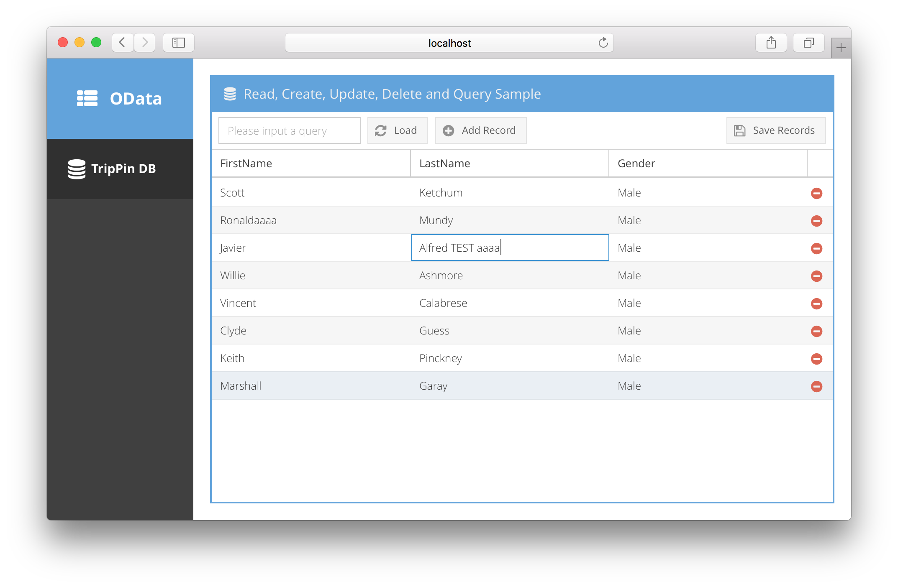
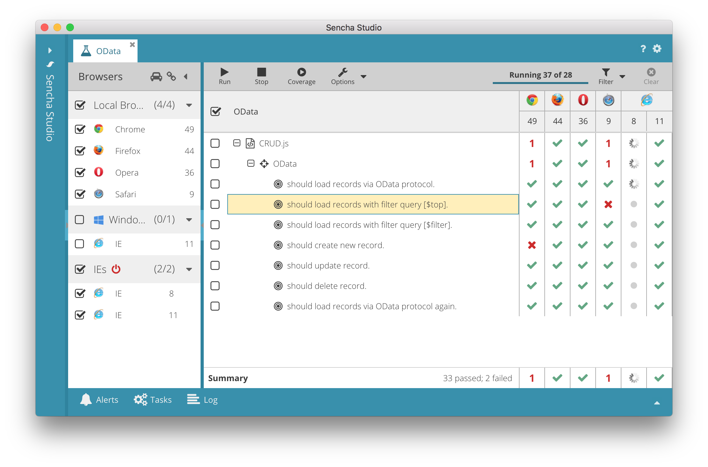

# sencha-odata

OData proxy for Ext JS 6 application. 

My idea is to wrap [Apache Olingo Library](https://olingo.apache.org/doc/javascript/index.html) by Sencha proxy class. This sample implementation works fine, but it's not a production-ready quality.

- Requesting resources
- Queries
- Creating a new resource
- Updating a resource
- Deleting a resource
- CORS Support

## Demo

You can check the demo application at following page.

[OData Demo Application](http://se.sencha.com/examples/sencha-odata)

If you want to run it locally, please install Sencha Ext JS library (v6 is required).

    $ cd sencha-odata
    $ sencha app upgrade {path/to/Ext-JS-SDK}

Then, build the demo application.

    $ cd example
    $ sencha app build development

## Installation

- Copy `sencha-odata` folder under `packages/local` to the your application's `packages` directory.
- Modify the app.json and include the `sencha-odata` into the requires list.
- Run sencha app refresh

## Usage

- Add requires to include `Ext.data.proxy.OData` class in the store or the model. 
- In the store, configure the proxy settings, type, serviceRoot, and url. 
- In the model, set the id property.

See sample usage at `example/app/store/People.js` and `example/app/model/Person.js`.

    proxy: {
        type: 'odata',
        serviceRoot: 'http://services.odata.org/V4/(S(njmtr5f5fmfxspybolfprbj4))/TripPinServiceRW/',
        url: 'People'
    }

## Test

You can execute test code with [Sencha Test](https://www.sencha.com/products/test/#overview). Please open the project directory from Sencha Test. Then it will recognize the workspace to test.

## Version

0.0.1

## Change log

[2016-03-13] **v0.0.1** Shinobu Kawano (shinobukawano)

* Created a experimental version.

## license

Copyright (c) 2016 Shinobu Kawano.
